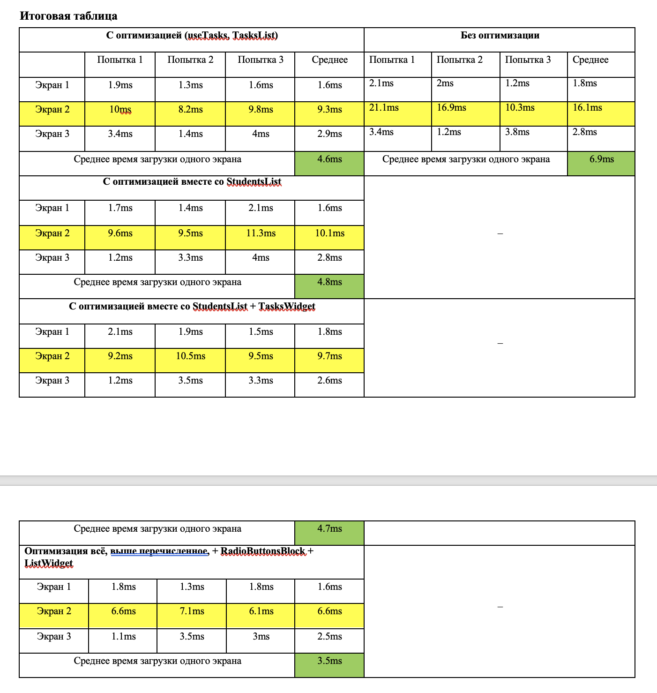
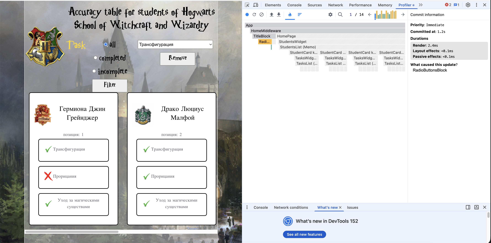
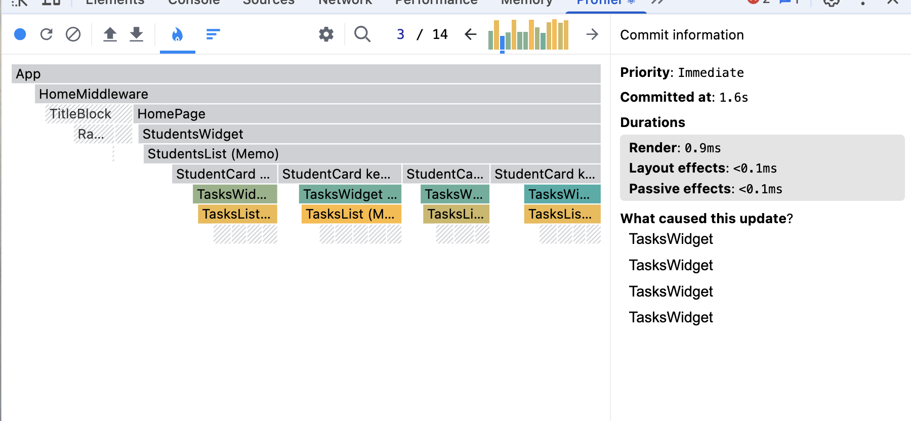
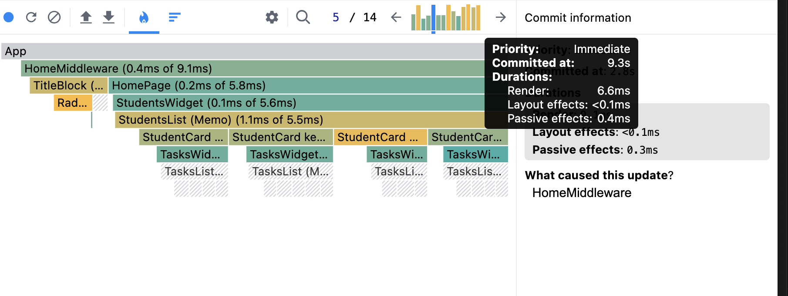
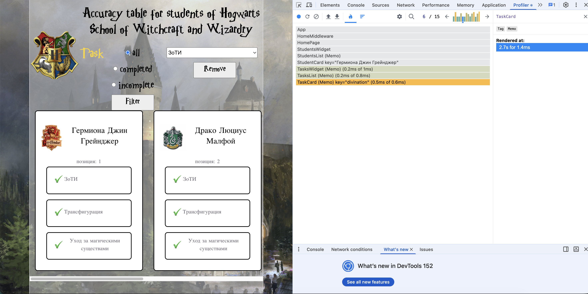
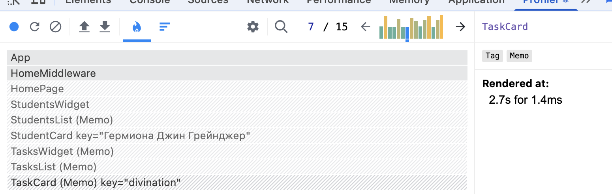
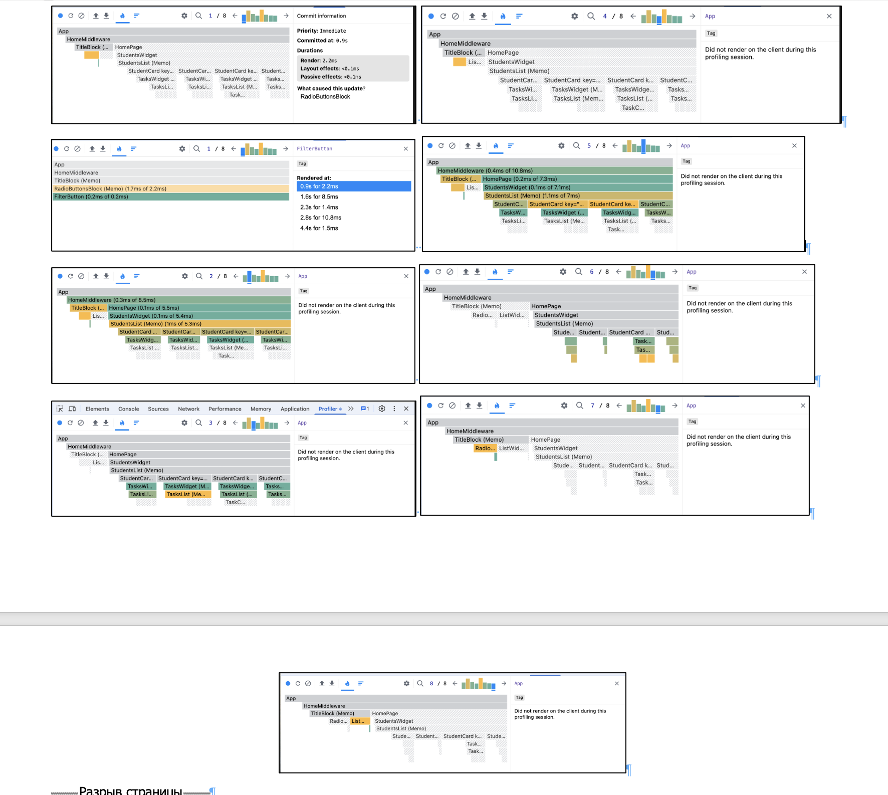

work by Galina Klimashova
lesson-1. А куда мы денемся?
lesson-2. Хорошо, что без вёрстки!

ВОТ ВЫВОДЫ (для допа)
Работа с React Developer Tool (Profiler)

 - просто картинка
 - просто картинка
document.docx (на одном уровне с Readme.md) - вот в этом документе находится подробный процесс "исследования" со скриншотами и сводной таблицей
это сама итоговая таблица

Основыне наблюдения
1. Часто перерисовываются компоненты - TasksWidgets, TasksList, TaskCard.

2. Так же при выполнии фильтрации перерисовывается весь App. В том числе компонент ListWidget, который вообще не имеет отношения к самой фильтрации (только к удалению). Его оптимизация привела к значительному снижению среднего времени отрисовки трёх экранов: от 6.9ms до 3.5ms, то есть практически в два раза. Да, для 5 задач это уже существенное ускорение процесса.

3. Имеет смысл поэкспериментировать с оптимизацией каждого компонента App. Не знаю точно, принесёт ли это пользу (возможно, будет ухудшение, так как компоненты отрисовываются из-за изменения пропсов, а не по прихоти родителя), но попробовать стоит.  

САМЫЙ главный скриншот нашей жизни: 
и ещё один 
и контрольный 
