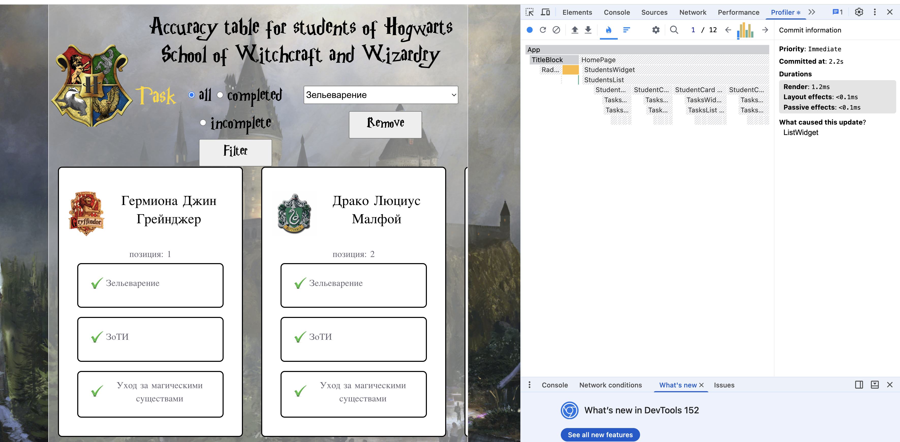
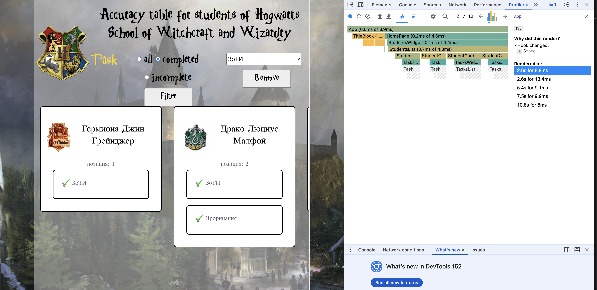

# React + TypeScript + Vite

This template provides a minimal setup to get React working in Vite with HMR and some ESLint rules.

Currently, two official plugins are available:

- [@vitejs/plugin-react](https://github.com/vitejs/vite-plugin-react/blob/main/packages/plugin-react) uses [Oxc](https://oxc.rs)
- [@vitejs/plugin-react-swc](https://github.com/vitejs/vite-plugin-react/blob/main/packages/plugin-react-swc) uses [SWC](https://swc.rs/)

## React Compiler

The React Compiler is not enabled on this template because of its impact on dev & build performances. To add it, see [this documentation](https://react.dev/learn/react-compiler/installation).

## Expanding the ESLint configuration

If you are developing a production application, we recommend updating the configuration to enable type-aware lint rules:

```js
export default defineConfig([
  globalIgnores(['dist']),
  {
    files: ['**/*.{ts,tsx}'],
    extends: [
      // Other configs...

      // Remove tseslint.configs.recommended and replace with this
      tseslint.configs.recommendedTypeChecked,
      // Alternatively, use this for stricter rules
      tseslint.configs.strictTypeChecked,
      // Optionally, add this for stylistic rules
      tseslint.configs.stylisticTypeChecked,

      // Other configs...
    ],
    languageOptions: {
      parserOptions: {
        project: ['./tsconfig.node.json', './tsconfig.app.json'],
        tsconfigRootDir: import.meta.dirname,
      },
      // other options...
    },
  },
])

```

You can also install [eslint-plugin-react-x](https://npmx.dev/package/eslint-plugin-react-x) and [eslint-plugin-react-dom](https://npmx.dev/package/eslint-plugin-react-dom) for React-specific lint rules:

```js
// eslint.config.js
import reactX from 'eslint-plugin-react-x'
import reactDom from 'eslint-plugin-react-dom'

export default defineConfig([
  globalIgnores(['dist']),
  {
    files: ['**/*.{ts,tsx}'],
    extends: [
      // Other configs...
      // Enable lint rules for React
      reactX.configs['recommended-typescript'],
      // Enable lint rules for React DOM
      reactDom.configs.recommended,
    ],
    languageOptions: {
      parserOptions: {
        project: ['./tsconfig.node.json', './tsconfig.app.json'],
        tsconfigRootDir: import.meta.dirname,
      },
      // other options...
    },
  },
])

```
ВОТ ВЫВОДЫ (для допа)
Работа с React Developer Tool (Profiler)

 - просто картинка
 - просто картинка
document.docx (на одном уровне с Readme.md) - вот в этом документе находится подробный процесс "исследования" со скриншотами и сводной таблицей
это сама итоговая таблица

Основыне наблюдения
1. Часто перерисовываются компоненты - TasksWidgets, TasksList, TaskCard.

2. Так же при выполнии фильтрации перерисовывается весь App. В том числе компонент ListWidget, который вообще не имеет отношения к самой фильтрации (только к удалению). Его оптимизация привела к значительному снижению среднего времени отрисовки трёх экранов: от 6.9ms до 3.5ms, то есть практически в два раза. Да, для 5 задач это уже существенное ускорение процесса.

3. Имеет смысл поэкспериментировать с оптимизацией каждого компонента App. Не знаю точно, принесёт ли это пользу (возможно, будет ухудшение, так как компоненты отрисовываются из-за изменения пропсов, а не по прихоти родителя), но попробовать стоит.  


САМЫЙ главный скриншот нашей жизни: 
и ещё один 
и контрольный 